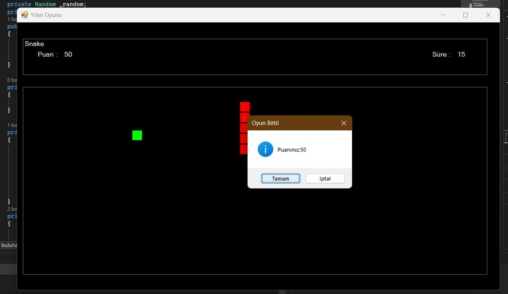

# Snake Game (C# Windows Forms)

A classic snake game for Windows, written in C# with Windows Forms as a university coursework project.

## Features

- Snake grows by one segment and the score goes up by 10 each time it eats food
- Food appears at a random position that is never on top of the snake
- Game over when the snake hits the wall or itself, with a restart option
- Score and elapsed-time counters
- Pause and resume

## Controls

| Key | Action |
| --- | --- |
| W / A / S / D | move up / left / down / right |
| P | pause |
| C | continue |

## Tech

- C# (.NET Framework 4.7.2)
- Windows Forms: `Timer` for the game loop, `Label` controls as snake segments and food, `KeyDown` event for input
- Rectangle collision checks (`IntersectsWith`) for food and self-collision

## Run it

Open `YilanOyunu.csproj` in Visual Studio 2019 or newer and press F5. Windows only.
